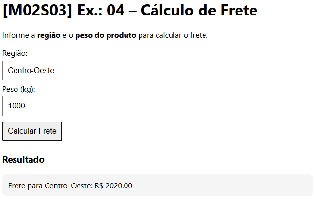

# [M02S03] Ex.: 04 – Cálculo de Frete

Exercício: calcular o frete de um produto de acordo com a região e peso.

### Fórmulas
- Norte: R$ 24 + (R$ 2,20 × peso)  
- Nordeste: R$ 22 + (R$ 2,10 × peso)  
- Centro-Oeste: R$ 20 + (R$ 2,00 × peso)  
- Sudeste: R$ 16 + (R$ 1,80 × peso)  
- Sul: R$ 18 + (R$ 1,90 × peso)  

### Regras
- Caso a região não seja válida, exibe: **“Região inválida”**  
- Resultado também aparece no **console**  

### Como executar
1. Abra `index.html` em um navegador.  
2. Digite a região e o peso.  
3. Clique em **Calcular Frete**.  
4. O resultado aparece no console.